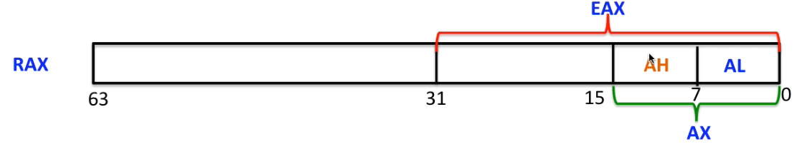
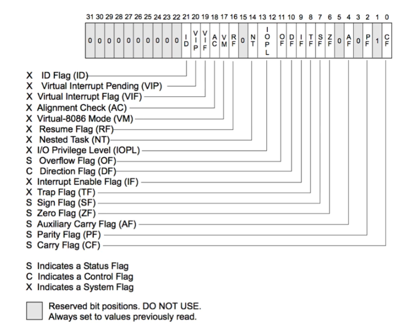

[COURSE] Assembly Language and Shellcode for x86_64
---------------------------------------------------
- Compilation process
```
hello.c -> hello.i -> hello.s -> hello.o + some other object files -> hello.exe
```
- Findout CPU arch
```bash
lscpu
```

### CPU general purpose registers structure


### RFLAGS = Reserved 32-bits + EFLAGS register


- system calls definition path
```
/usr/include/x86_64-linux-gnu/asm/unistd_64.h
```

- Invoking System Call with syscall
```
| Register | Value                           |
|----------|---------------------------------|
| RAX      | # of System Call & Return value |
| RDI      | 1st Argument                    |
| RSI      | 2nd Argument                    |
| RDX      | 3rd Argument                    |
| R10      | 4th Argument                    |
| R8       | 5th Argument                    |
| R9       | 6th Argument                    |
```

- For shellcodes and efficient programming 
    - Reduce the instruction size
    - Remove nulls

- Keep in mind in assembly focus on how samll you can make the binary

- Fundamental Data types
```
| Data type        | Length  |
|------------------|---------|
| Byte             | 8 bit   |
| Word             | 16 bit  |
| Double Word      | 32 bit  |
| Quad Word        | 64 bit  |
| Double Quad Word | 128 bit |
```

- NASM properties
```
- Case Sensitive syntax
- Access mem ref with []
    - mov rax, message          # moves addr into rax
    - mov rax, [message]        # moves value into rax
- Define initialized data: db, dw, dd, dq, dt
- Define uninitialized data: resb, resw
- Special tokens: $, $$ 
```

- GDB TUI(Test User Interface) mode
- Arithmetic instructions
```
| Instruction | Description                                 |
|-------------|---------------------------------------------|
| ADD         | Add two values                              |
| ADC         | Add with carry (if carry flag is set)       |
| SUB         | Subtract two values                         |
| SBB         | Subtract with borrow (if carry flag is set) |
| INC         | Increment by one                            |
| DEC         | Decriment by one                            |
```

- Bit shifting instructions
    - Note that in shift right carry flag virtually would be at the rigt side 
```
| Instruction | Definition                 |
|-------------|----------------------------|
| SHL         | Shift one bit to the left  |
| SHR         | Shift one bit to the right |
| SAR         | Shift Arithmatic to Right  |
| SAL         | Shift Arithmatic to Left   |
| ROR         | Rotate to Right            |
| ROL         | Rotate to Left             |
```

- Control instructions
```
| Instruction | Description        |
|-------------|--------------------|
| JMP         | unconditional jump |
| JXX         | conditional jump   |
```

- LOOP use ECX which decrements until become 0
    - Note that preserve ECX through loop (for e.g using stack)
    - Other variations: LOOPE, LOOPNE

- Procedures
    - Set of operations grouped together
    - Called often from different places in the code
    - In NASM procedures are defined using labels
    - When a preocedure is called a Stack frame is created at the current location of RSP and acts like a prtition
    - Stack frame will remove when procedure returns
    - Arguments passed via (Registers, Stack, As data struct in memory refrenced by registers or on stack)
```
CALL <procedure_name>
```

- String operations
    - scasb, scasw, scasd, scasq to compare with al, ax, eax, rax relativly (register to memory comparison)         
    - cmpsb, cmpsw, cmpsd, cmpsq to compare memory refrenced by RSI & RDI registers (memory to memory comparison)
    - lodsb, lodsw, lodsd, lodsq to move from memory into register
    - stosb, stosw, stosd, stosq to move from register into memory
    - movsb, movsw, movsd, movsq to move from memory into memory which are refrenced by RSI & RDI registers

### Shellcode
- Machine code with specific purpose
- Can be executed by CPU directly without any assembling/linking or compilation
- Deliverd as part of an exploit or added into an executable
- Its size is so important to be as smaller as possible
- Get all shellcode on binary file from objdump
```
objdump -d <obj_file> | grep -Po '\s\K[a-f0-9]{2}(?=\s)' | sed 's/^/\\x/g' | perl -pe 's/\r?\n//' | sed 's/$/\n/'
```
- Try to find each address in shellcode dynamically and do NOT use hardcodded adresses
- JMP-CALL-POP technique to avoid using hardcodded adresses
```
    jmp call_shellcode
shellcode:
    pop rsi
    ...
    ...
    ...

call_shellcode:
    call shellcode:
    HelloWorld db "Hello World!"
```

- Using python to generate shellcode
```python
shell = '/bin/sh'
shell[::-1].encode("utf-8").hex()         # reverse string and encode into hex
```